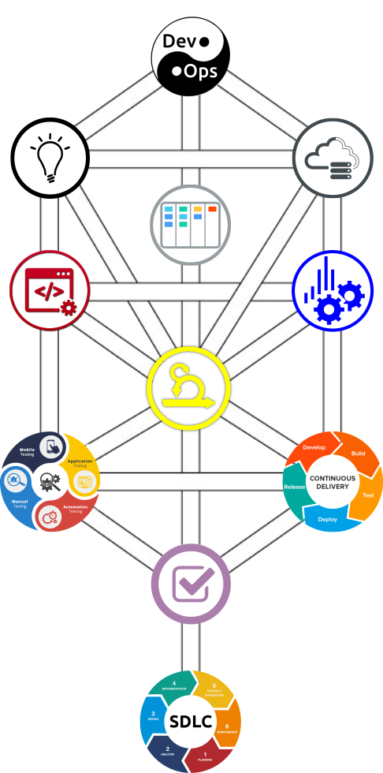

# DevOps Developer Guidelines & Resources
VTA development teams have implemented a Board of Directors initiative to adopt industry-standard best practices for software development and deployment to become an innovator in technology within Silicon Valley to help educate, facilitate, and assist other public transit agencies and government organizations in promoting public transit use.

We request all software developers, project managers, and user acceptance testing stakeholders follow and adhere to the [Agile methodologies as documented in our Wiki on GitHub](https://github.com/vta/devops/wiki).

As time permits, we will continue our efforts to add documentation, guidelines, and recommendations to explain further our concept of Agile methodologies and the SDLC, as illustrated in the diagram below.

## Agile DevOps SDLC pathways

<map name="DevOpsAgileSDLC">
<area shape="circle" coords="383,78,52" alt="GitHub - DevOps : awesome learning" target="_blank" href="https://github.com/Lets-DevOps/awesome-learning" />
<area shape="circle" coords="552,199,52" alt="IT Infrastructure" target="_blank" href="https://en.wikipedia.org/wiki/IT_infrastructure" />
<area shape="circle" coords="216,198,52" alt="W3C Web Design Standards" target="_blank" href="https://www.w3.org/standards/webdesign/" />
<area shape="circle" coords="383,279,52" alt="OpenProject CE - Agile and SCRUM management" target="_blank" href="https://www.openproject.org/download-and-installation/" />
<area shape="circle" coords="552,357,52" alt="Debian Handbook - Monitoring" target="_blank" href="https://debian-handbook.info/browse/stable/sect.monitoring.html" />
<area shape="circle" coords="381,473,55" alt="Agile Model &amp; Methodology: Guide for Developers and Testers" target="_blank" href="https://www.guru99.com/agile-scrum-extreme-testing.html" />
<area shape="circle" coords="215,356,52" alt="Launchpad Development Wiki" target="_blank" href="https://dev.launchpad.net/" />
<area shape="circle" coords="552,584,66" alt="Continuous Delivery Pipleline" target="_blank" href="https://en.wikipedia.org/wiki/Continuous_delivery" />
<area shape="circle" coords="215,584,65" alt="Continuous Integration Processes" target="_blank" href="https://en.wikipedia.org/wiki/Continuous_integration" />
<area shape="circle" coords="384,704,52" alt="User Acceptance Testing " target="_blank" href="https://www.toolsqa.com/software-testing/user-acceptance-testing-uat/" />
<area shape="circle" coords="383,868,65" alt="SDLC - Software Development Life Cycle" target="_blank" href="https://www.softwaretestingmaterial.com/sdlc-software-development-life-cycle/" />
</map>

